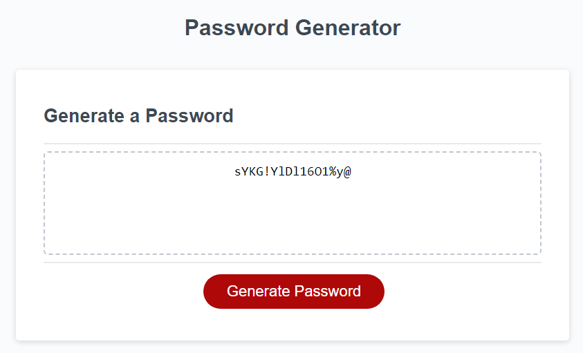

# Password Generator Web App

## Overview

This web app provides a convenient way to generate secure, unique passwords based on user-specified criteria. It aims to promote strong password practices and help users protect their online accounts.

## Features

Customizable password generation:
Specify desired password length.
Include uppercase and lowercase letters, numbers, and symbols.

## Screenshot

## Usage

Access the web app in your browser, at https://aaronh-o.github.io/password-generator/.
Click the "Generate Password" button.
Specify the desired password length, and select the desired character types to include.
Copy the password if desired.
